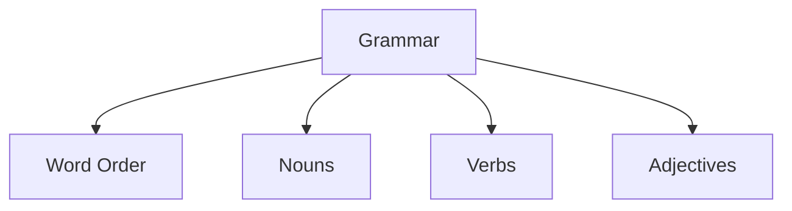

## Core elements



## Schema

```typescript
interface Grammar {
    word_order: "SOV" | "SVO" | "VSO" | "VOS" | "OVS" | "OSV";
    noun: {
        cases: string[];
        genders: string[];
        plural_forms: Array<{
            pattern: string;
            suffix?: string;
            exceptions?: Record<string, string>;
        }>;
    };
    verb: {
        tenses: string[];
        conjugation_patterns: Record<string, Record<string, string>>;
    };
    adjectives: {
        position: "prenominal" | "postnominal";
        comparative?: string;
        superlative?: string;
    };
}
```