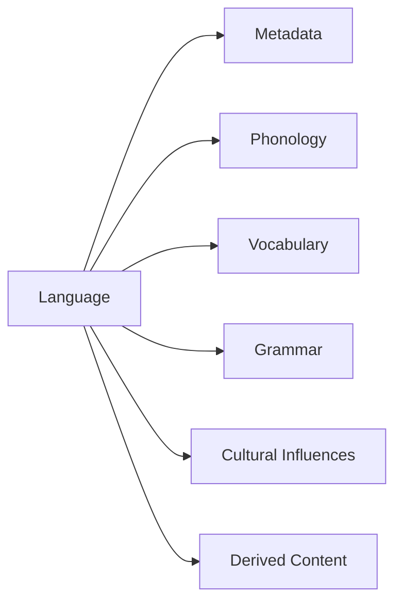

# Language Data Structure Overview

## Core Components



## JSON Structure

```json
{
    "metadata": {},
    "phonology": {},
    "vocabulary": {},
    "grammar": {},
    "cultural_influences": {},
    "derived_content": {}
}
```