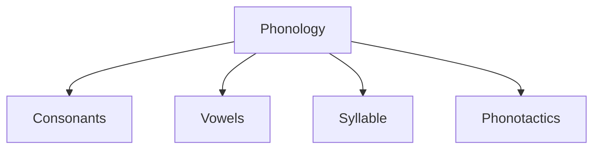

# Phonology Structure

## Components



## Schema

```typescript
interface Phonology {
    consonants: {
        stops: string[];
        fricatives: string[];
        nasals: string[];
        liquids: string[];
        constraints: {
            initial_clusters: string[];
            forbidden_clusters: string[];
        };
    };
    vowels: {
        short: string[];
        long: string[];
        diphthongs: string[];
    };
    syllable: {
        structure: string;
        stress_pattern: string;
    };
    phonotactics: {
        max_initial_consonants: number;
        max_final_consonants: number;
        vowel_harmony: boolean;
    };
}
```