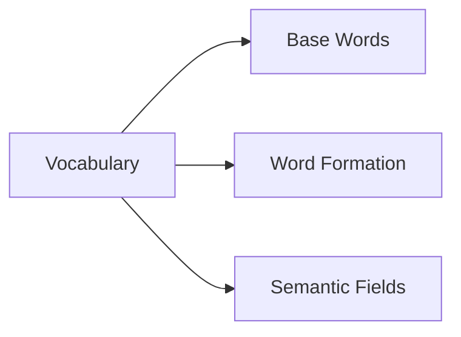

## Word Storage Approach



## Schemas

```typescript
interface Vocabulary {
    base_words: Record<string, string>;
    word_formation_rules: {
        diminutive?: string;
        augmentative?: string;
        material?: string;
    };
    semantic_fields: Record<string, Record<string, string>>;
}
```