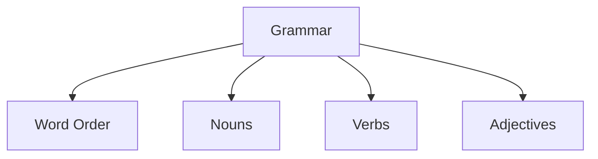
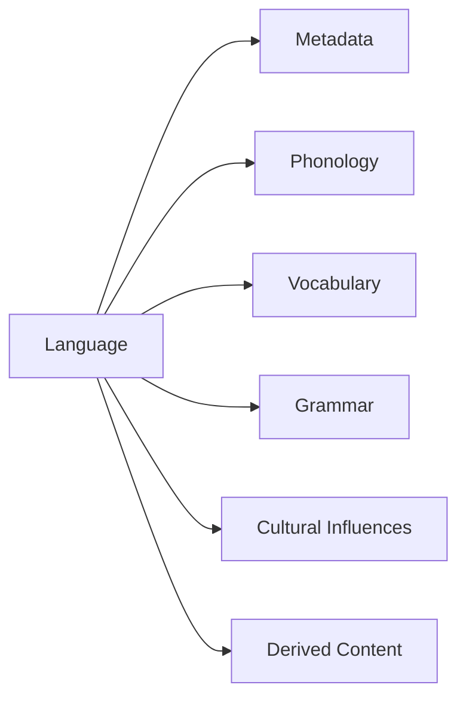
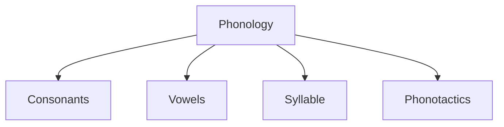
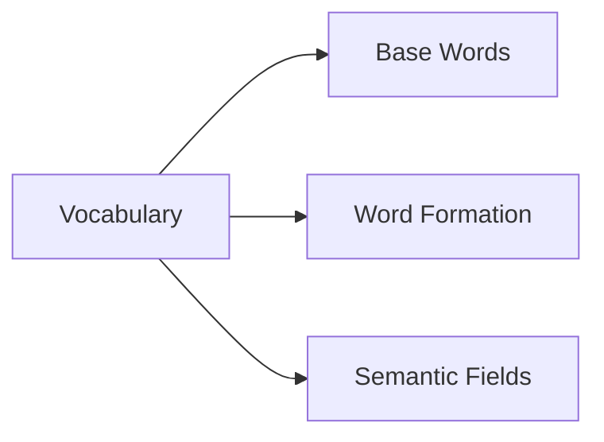

# Data Structures

## Table of Contents
- [Cultural Influences](#cultural-influences)
- [Derived Content](#derived-content)
- [Grammar](#grammar)
- [Language Object](#language-object)
- [Metadata](#metadata)
- [Phonology](#phonology)
- [Vocabulary](#vocabulary)

## Cultural Influences


## Purpose
Documents how a culture shapes language development, affecting:
- Word connotations
- Taboo terms
- Specialized vocabulary
- Grammatical emphasis

## Schema

```typescript
interface CulturalInfluences {
    environment: EnvironmentType;
    technology_level: number;  // 1-10 scale
    social_structure: SocialStructureType;
    values: string[];
    taboos: string[];
    contact_languages: string[];
}

type EnvironmentType =
    | "mountainous"
    | "forest"
    | "desert"
    | "coastal"
    | "urban"
    | "underground";

type SocialStructureType = 
    | "clan_hierarchy"
    | "egalitarian"
    | "matriarchal"
    | "imperial"
    | "tribal";
```

## Derived Content


## Purpose
Stores ML-generated content that's derived from other language components.

## Schema

```typescript
interface DerivedContent {
    generated_words: Array<{
        word: string;
        meaning: string;
        components: string[];
        confidence: number;  // 0-1
    }>;
    sample_sentences: Array<{
        sentence: string;
        translation: string;
        structure_analysis: string;
    }>;
    generation_parameters: {
        model_version: string;
        temperature?: number;
        top_k?: number;
    };
}
```

## Grammar


## Core elements



## Schema

```typescript
interface Grammar {
    word_order: "SOV" | "SVO" | "VSO" | "VOS" | "OVS" | "OSV";
    noun: {
        cases: string[];
        genders: string[];
        plural_forms: Array<{
            pattern: string;
            suffix?: string;
            exceptions?: Record<string, string>;
        }>;
    };
    verb: {
        tenses: string[];
        conjugation_patterns: Record<string, Record<string, string>>;
    };
    adjectives: {
        position: "prenominal" | "postnominal";
        comparative?: string;
        superlative?: string;
    };
}
```

## Language Object


## Core Components



## JSON Structure

```json
{
    "metadata": {},
    "phonology": {},
    "vocabulary": {},
    "grammar": {},
    "cultural_influences": {},
    "derived_content": {}
}
```

## Metadata


## Purpose
Contains administrative information about the language.

## Schema

```typescript
interface Metadata {
    language_name: string;
    creator: string;
    created_at: ISO8601String;
    last_modified: ISO8601String;
    version: number;
    description?: string;
    tags: string[];
}
```

## Phonology


## Components



## Schema

```typescript
interface Phonology {
    consonants: {
        stops: string[];
        fricatives: string[];
        nasals: string[];
        liquids: string[];
        constraints: {
            initial_clusters: string[];
            forbidden_clusters: string[];
        };
    };
    vowels: {
        short: string[];
        long: string[];
        diphthongs: string[];
    };
    syllable: {
        structure: string;
        stress_pattern: string;
    };
    phonotactics: {
        max_initial_consonants: number;
        max_final_consonants: number;
        vowel_harmony: boolean;
    };
}
```

## Vocabulary


## Word Storage Approach



## Schemas

```typescript
interface Vocabulary {
    base_words: Record<string, string>;
    word_formation_rules: {
        diminutive?: string;
        augmentative?: string;
        material?: string;
        // Affixes
    };
    semantic_fields: Record<string, Record<string, string>>;
}
```

